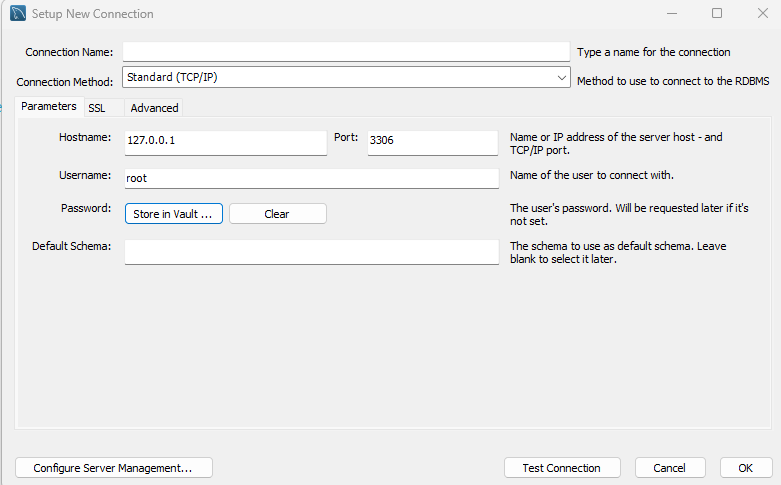
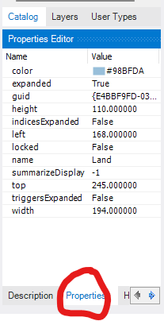
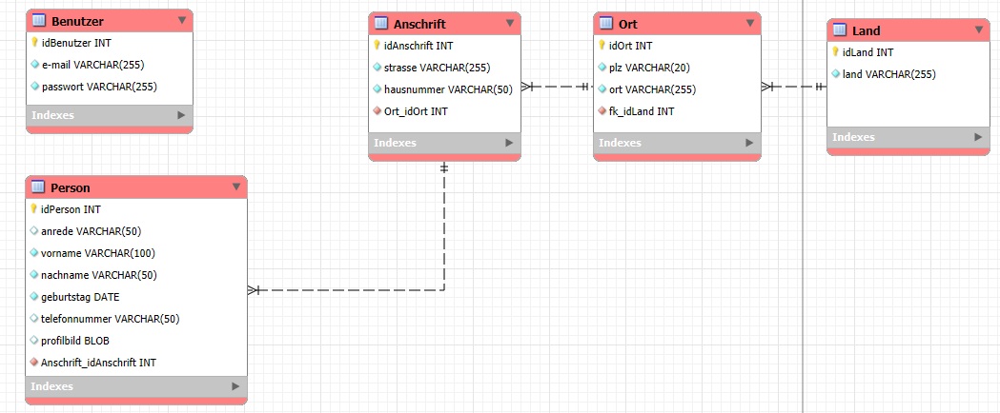

## 1. installieren (8.0.43.0)
## 2. Connection einrichten 
   
   3. passwort?
## 4. Diagram erstellen
   5. Farbe ändern
        

Unterschied Identifying und non-Identifying!

## 5. Diagram Design

6. Forward Engineer
   7. Drop Object before CREATE aktivieren 
   8. Visible entfernen

7. Apache starten 
   8. http://localhost/phpmyadmin/